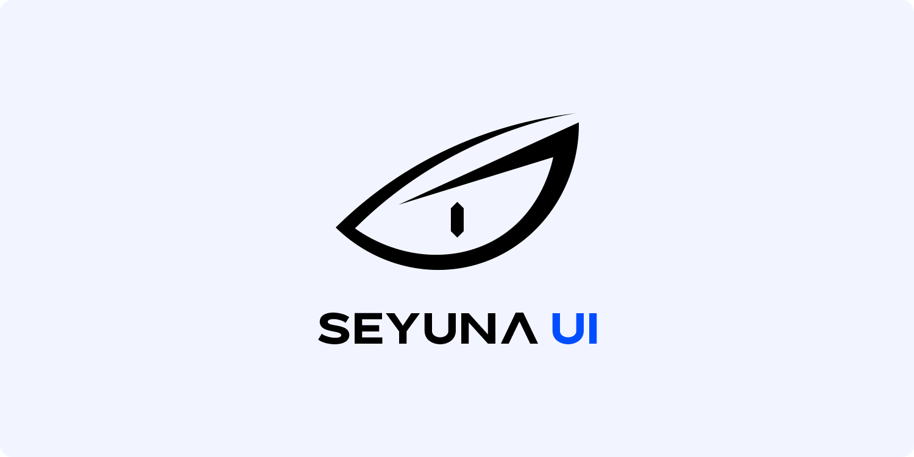
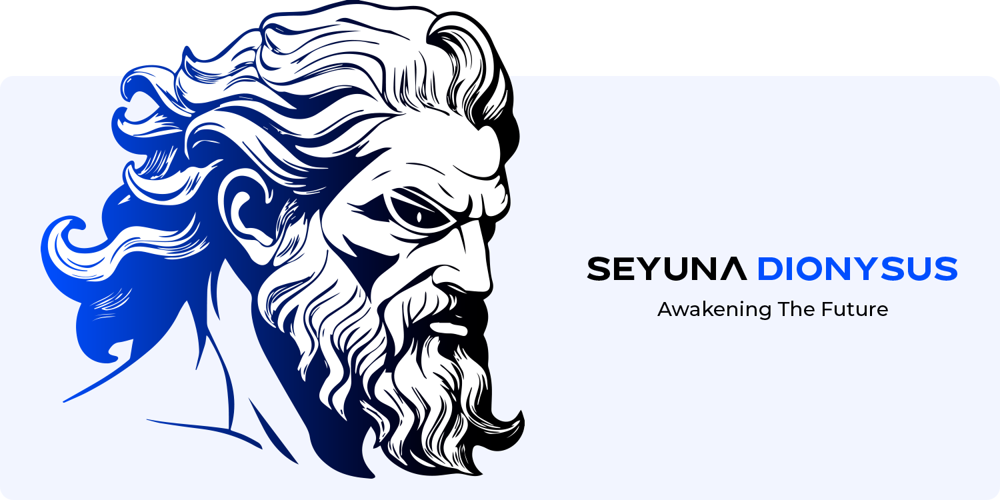

<picture>
  <source srcset=".github/assets/header-dark.png" media="(prefers-color-scheme: dark)">
  
</picture>

  

  

# Introduction

Seyuna UI is not your average design system for **React**. It’s a **game changer**. Seyuna UI provides developers access to a sophisticated component ecosystem that is unique, fast, accessible and well-optimized for the modern web.

As developers ourselves, we understand the challenges that can arise from using other component libraries or CSS utility frameworks like Tailwind CSS, Bootstrap, and others. These utility frameworks often involve embedding CSS directly into HTML via class names. While this approach can speed up styling, it can also lead to cluttered, less readable HTML, making your code harder to maintain and scale over time.

With Seyuna, we believe in a different approach. An approach that keeps your HTML and CSS separate as it was intended to be. This is why we designed Seyuna UI: to address these common challenges and streamline your development process.

  

<picture>
  <source srcset=".github/assets/dionysus-dark.png" media="(prefers-color-scheme: dark)">
  
</picture>

Dionysus is the first phase of Seyuna and the beginning of a new revolution in web development.

# Dionysus Features

🟦 Written In **Typescript**

🟦 Lightweight, SEO-optimized, and Blazing Fast

🟦 100% Open-Source

🟦 SCSS modules (Neat & Organized 😉)

🟦 Automatic Dark & Light Mode

🟦 Upscaling - **The First Of Its Kind** (Your website will automatically upscale to look flawless on any screen size)

🟦 Fully Accessible & Compliant With **ADA, AODA, EAA, WCAG**, and **WAI-ARIA**

🟦 Follows The Strictest Guidelines To Ensure Stability And Reliability

  

# Coming Soon

🟨 Ecosystem

🟨 GDPR Compliance Components

🟨 Templates

🟨 CMS Starters

  

# Contributions

No contributions are accepted at the moment.
